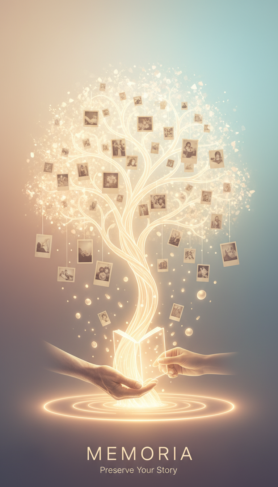
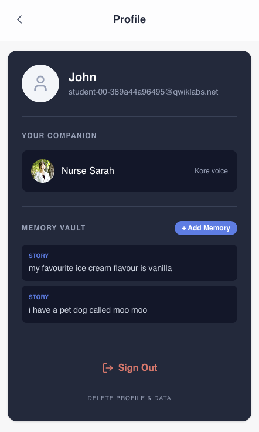
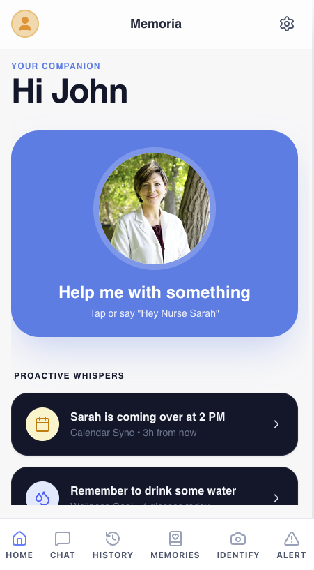
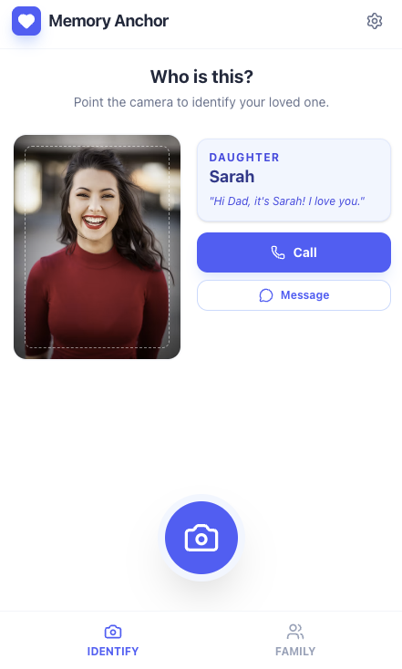
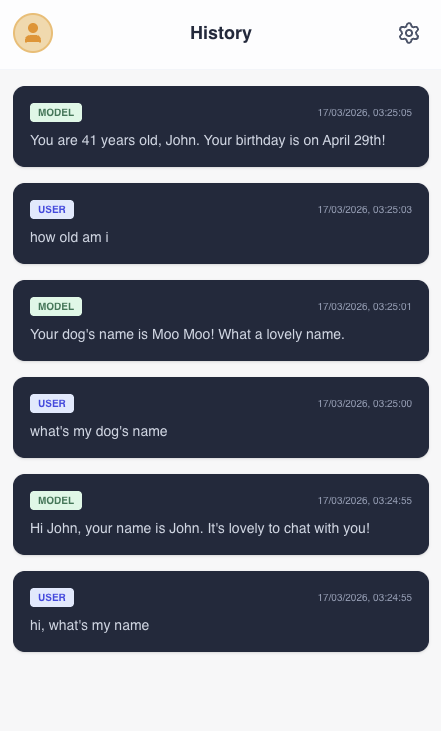
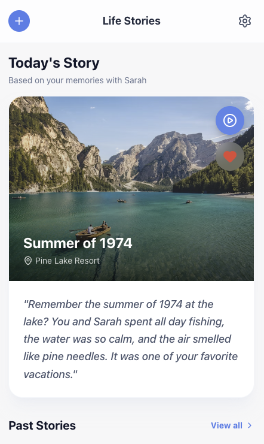
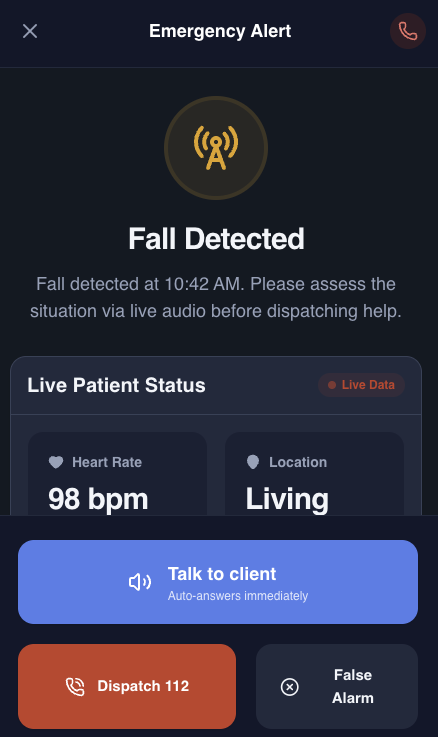

  
  <h1>Memoria</h1>
  
<b>Empowering Alzheimer's Patients and Caregivers through AI-Driven Compassion</b>

---

  <h2><a href="https://youtu.be/cSmVhreDQ2w">▶️ Watch the Demo Video</a></h2>
  
<em>(Recommended: Play at 1.5X speed)</em>

---

## 🌟 The Inspiration
**Built from a place of love and necessity.** We have a team member who is a dedicated caretaker for a loved one with Alzheimer's. Their daily struggles inspired us to explore how modern AI could make life just a little bit easier, safer, and more dignified for individuals living with memory loss, while simultaneously providing peace of mind to their caregivers.

## ✨ Key Features

### 🗂️ Virtual Memory Bank (RAG Foundation)
At the heart of Memoria is a secure, Firebase-backed virtual memory. It safely stores vital personal facts: daily medications, dangerous allergies, favorite flavors, or the name of a beloved pet. This database acts as the **Retrieval-Augmented Generation (RAG)** context for our AI, ensuring all interactions are deeply personalized and factually accurate for the patient.

### 🗣️ Bi-directional Voice Caregiver
A fully conversational voice agent that doesn't just talk, but *knows* the patient. By accessing the Virtual Memory Bank, it provides familiar, context-aware companionship and assistance.

### 👁️ Loved One Identifier
"Who is this?" is a heartbreaking question. Using advanced image recognition, Memoria helps the user instantly remember who they are looking at by matching faces to their trusted circle of loved ones.

### 💬 Chat Virtual Caregiver with History
A text-based companion for the patient that doubles as a crucial monitoring tool. Caregivers can review the chat history to observe the user's day-to-day interactions, mood changes, and determine if urgent attention is needed.

### 🌅 Memory Therapy
In times of distress or negative emotions, the AI agent dynamically selects the most soothing and joyful memories from the patient's past to help calm and comfort them. It's targeted emotional support when they need it most.

### 🚨 Emergency Assistant
Safety is paramount. Memoria can detect dangerous situations and automatically relay critical, real-time context (like location and medical history) to first responders through the RAG system.

---

## 🛠️ Technologies Used

This project heavily leverages Google's AI ecosystem and Firebase to deliver a context-aware, highly personalized, and secure assistant.

### 🧠 Google Gemini AI
- **`gemini-3-flash-preview` (Multimodal Vision)**: Powers the **Loved One Identifier**. It processes image inputs alongside RAG data (known loved ones) to recognize faces and gracefully help patients remember their family and friends.
- **`gemini-2.5-flash` (Reasoning & Chat)**: The core reasoning engine for the **Virtual Caregiver**. It utilizes conversation history and dynamic system instructions to provide empathetic, highly contextual responses based on the patient's personal memory bank.
- **`gemini-2.5-flash` + Google Maps Tool**: Drives the **Emergency Assistant**, automatically verifying physical addresses and providing life-saving situational context in real-time.
- **`gemini-2.5-flash-preview-tts` (Text-to-Speech)**: Brings the **Voice Caregiver** to life, generating realistic, comforting spoken audio (featuring customizable personas like Kore, Puck, and Fenrir).
- **`@google/genai` SDK**: The official SDK used across the application to interface cleanly and reliably with all Gemini models and tools.

### 🔥 Firebase
- **Firestore (NoSQL Database)**: The robust backend for our **Virtual Memory Bank**. It persistently stores patient profiles, medical facts, and relationships, forming the critical retrieval backend for our RAG architecture.
- **Firebase Authentication**: Ensures that caretakers and patients have isolated, secure access to highly sensitive medical and personal data via Google Auth.

### 💻 Frontend & Ecosystem
- **React 19, TypeScript, & Vite**: Delivers a snappy, reliable, and type-safe user interface.
- **Tailwind CSS**: Used for rapid, accessible UI styling, carefully tailored for readability and ease of use by elderly patients.